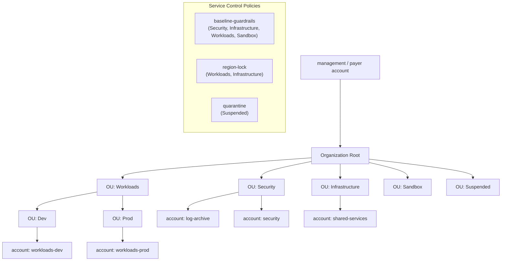

# AWS Landing Zone (Terraform)

Opinionated, reusable foundations for onboarding new client accounts onto AWS:
multi-account governance, network and security baselines, and least-privilege
access — all as code, validated statically in CI.

## 1. Objective

Stand up a production-ready **AWS landing zone** that a service company can drop
onto a fresh AWS Organization to make new accounts safe by default:

- **Governance** — AWS Organizations (feature set ALL) with a clear OU hierarchy
  and reusable Service Control Policies (guardrails).
- **Centralized audit** — an organization CloudTrail whose logs land in a
  dedicated, encrypted, cross-account bucket in the `log-archive` account.
- **Least-privilege access** — IAM Identity Center permission sets, groups, and
  group→account assignments.
- **Network** — a segmented, reusable three-tier VPC (public / private-app /
  private-data) with NAT, flow logs, a locked-down default security group, and a
  data-tier NACL.
- **Cost control** — AWS Budgets, Cost Anomaly Detection, and SNS alerting.
- **Keyless CI/CD** — GitHub OIDC federation (no static AWS keys) with a deploy
  role scoped to this repository and branch.

Default region: **eu-west-3**.

## 2. Account & OU topology



The **management account is deliberately left out of the restrictive SCPs** so it
retains break-glass access.

## 3. Prerequisites

- Terraform `>= 1.6`, `tflint`, and `checkov` for the local quality loop.
- An AWS Organization management account with **billing on Blaze/Pay-as-you-go**
  (Organizations, Budgets and Cost Explorer require it).
- **IAM Identity Center enabled** in the management account (a one-time console
  action that cannot be created through the AWS provider — it is looked up).
- The cross-account role (`OrganizationAccountAccessRole` by default) present in
  member accounts — Organizations creates it automatically for new accounts.
- For CI: GitHub repository secrets `AWS_ROLE_ARN`, `TF_STATE_BUCKET`,
  `TF_LOCK_TABLE`, `TF_STATE_KMS_KEY`.

## 4. How to run

The remote state backend is a chicken-and-egg problem, so `bootstrap/` runs
first with local state to create the S3 bucket + DynamoDB lock table + KMS key.
Everything else then uses that backend via a **partial config** (no account or
bucket name is committed):

```bash
# 0. One-time: create the remote state backend
cd bootstrap
cp terraform.tfvars.example terraform.tfvars   # set a globally unique bucket name
terraform init && terraform apply

# 1. Copy the backend template and fill in the bootstrap outputs
cp backend.hcl.example environments/dev/backend.hcl   # (and global/, environments/prod/)

# 2. Drive everything else through the Makefile
make check                 # fmt + validate + tflint + checkov (no AWS calls)
make plan  ENV=dev         # plan an environment
make apply ENV=prod        # apply an environment
```

`make help` lists every target. The `global/` root (Organizations, SCPs,
CloudTrail, Identity Center, OIDC) is applied directly with Terraform; see the
two-phase bootstrap note in `global/providers.tf` (member accounts must exist
before the cross-account providers can authenticate).

## 5. What this project demonstrates

- Multi-account AWS governance with Organizations, OUs and **reusable,
  toggle-driven SCPs**.
- Cross-account architecture with **aliased providers** (the org trail spans the
  management and log-archive accounts).
- Defense-in-depth networking: subnet tiering, an isolated data tier, NACLs, flow
  logs, and a stripped default security group.
- Security hygiene: KMS-encrypted state and logs, enforced TLS, IMDSv2, account
  password policy, S3 public-access blocks, EBS default encryption.
- Least-privilege IAM, including a **keyless CI deploy role** via GitHub OIDC.
- A real **static quality gate** — `terraform fmt`, `validate`, `tflint` and
  `checkov` run on every module and root, and in CI on every PR.

## 6. Architecture choices & rejected alternatives

- **Plain Terraform modules over AWS Control Tower / LZA.** Control Tower is
  faster to click together but opaque and hard to version in Git; hand-written
  modules keep every decision reviewable and portable across clients.
- **Partial backend config over hardcoded backends.** Bucket and table names are
  injected at `init` time so no client-specific value ever lands in the repo —
  the same code serves every client.
- **SCPs attached to OUs, not the root.** Attaching to OUs keeps the management
  account unrestricted for break-glass while still covering all member accounts.
- **Isolated data tier (no NAT route).** The data subnets have no internet path
  and a NACL that only accepts the application tier on database ports — blast
  radius stays small.
- **Service-scoped deploy role, not `AdministratorAccess`.** The CI role is
  granted the specific service namespaces the landing zone manages rather than a
  blanket admin policy, and access is gated by OIDC + branch + short sessions.
- **Single NAT in dev, per-AZ NAT in prod.** A cost/resilience trade-off exposed
  as a variable (`single_nat_gateway`).

## 7. Likely interview questions

**Q. Why are the SCPs attached to OUs instead of the organization root?**
An SCP on the root applies to *every* account including the management account,
which can lock you out of break-glass operations and even of fixing the SCP
itself. Attaching to the member OUs (Security, Infrastructure, Workloads,
Sandbox) covers all workload accounts while leaving the management account free.

**Q. How does the pipeline authenticate to AWS without storing keys?**
Through GitHub OIDC. GitHub issues a signed OIDC token to the workflow; the IAM
role's trust policy only accepts that token for this exact repository and the
allowed branches (`sub` claim) with `aud = sts.amazonaws.com`. AWS exchanges it
for short-lived credentials via `AssumeRoleWithWebIdentity` — no static secret
ever exists.

**Q. Why does the CloudTrail module need two providers, and where does the bucket
live?** The organization trail is created in the management account, but its logs
must be isolated from the accounts that generate them, so the destination bucket
and KMS key live in the dedicated `log-archive` account. The module therefore
takes two aliased providers (`aws.management`, `aws.log_archive`); cross-account
access is granted by the bucket and KMS key policies scoped to the trail ARN and
the organization id.
```
